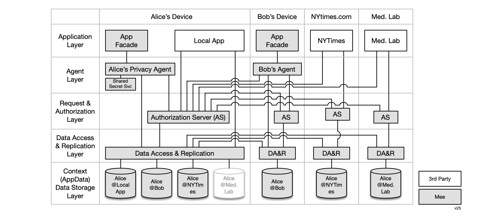

### Architecture

The Mee multi-layer architecture is shown below:

**Application layer**

The application layer consists of Mee-compatible apps. The diagram shows four sample apps that Alice might interact with. These include, a local app, an app that is a facade for Bob's agent, a news site app (NYTimes), and a medical lab app. Note: each person's agent appears to other users' agents as an app called the *agent facade*. 

**Agent layer**

The agent layer consists of a privacy agent app with a UI that gives the user (Alice or Bob) control over the management of their data. The agent's UI allows Alice to inspect and in some cases edit each of the partial representations of her in each context. 

**Request & Authorization layer**

The request and authorization layer handles requests for access to data from Alice's agent as well as from local apps, remote apps, and other user's privacy agents. Alice's authorization server grants or revokes access by these requests to data in the context data storage layer. 

**Data Access & Replication layer**

The data access and replication layer provides data access (as controlled by tha authorization layer above) to the data in each of Alice's contexts. It manages the replication of changes to the data in one of Alice's contexts both (i) between the corresponding app and Alice's agent as well as (ii) among Alice's edge devices (phone, tablet, laptop, etc.).

**Context Data Storage layer**

The context data storage layer holds a set of contextualized representation of the user as defined by an app. For the four sample apps we're discussing here, three corresponding context data stores stored on Alice's device--the Med Lab app's context data store is not replicated on Alice's local device (perhaps as a hypothetical example because the medical data set is too large for Alice's device)

#
[
Edit this page
](https://github.com/MeeProject/ecosystem/edit/mdBook/src/Architecture.md)