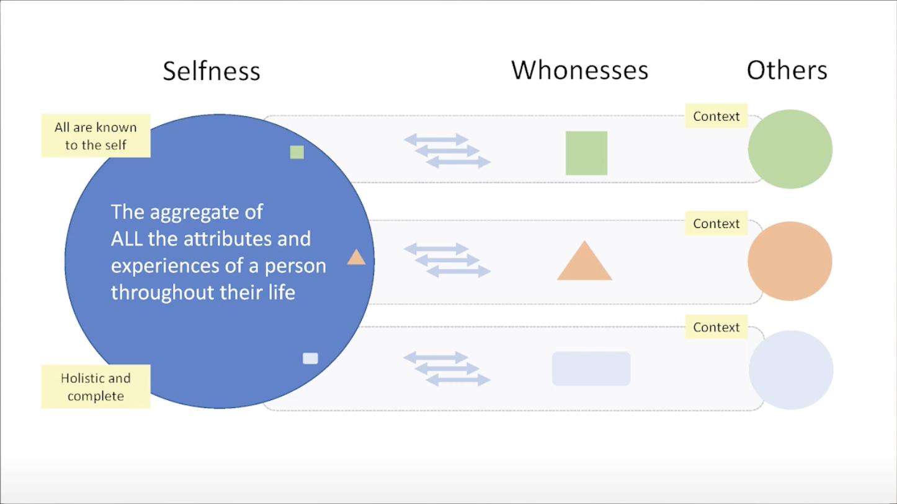
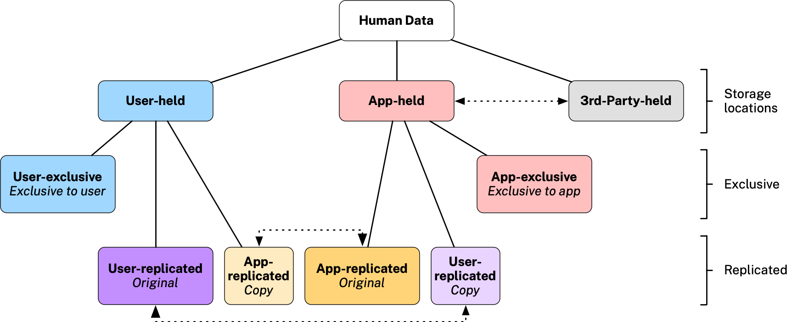

# Concepts

### Selfness vs. Whoness

In his [last public speech](https://www.youtube.com/watch?v=9DExNTY3QAk) [Kim Cameron](https://en.wikipedia.org/wiki/Kim_Cameron_(computer_scientist)) introduced two useful definitions based on archaic English:

- **Selfness**: The sameness of a person or thing at all times or in all circumstances. The condition of being a single individual. The fact that a person or thing is itself and not something else. Individuality, personality. 
- **Whoness**: Who or what a person or thing is. A distinct impression of a single person or thing presented to or perceived by others. A set of characteristics or a description that distinguishes a person or thing from others. 

The following diagram illustrates these concepts and introduces the notion of context:

 

### Personal data

* [User-exclusive Data article](https://medium.com/meefound/exclusive-self-ownership-9917cb6bdd8c) - introduction to exclusive-to-the-user data
* [Categories of personal data](https://docs.google.com/spreadsheets/d/11F-V793seAon7xqFX2HEqeFhHvxttEUMkKSOrbM0ptc/edit#gid=477806070) - four main categories of user data (user input, app sensed, app generated and app inferred) and how examples of these categories are managed in different ways (user-exclusive, user-shared, user-replicated, app-shared, app-replicated or app-shared)
* Location/sharing alternatives: 

.
