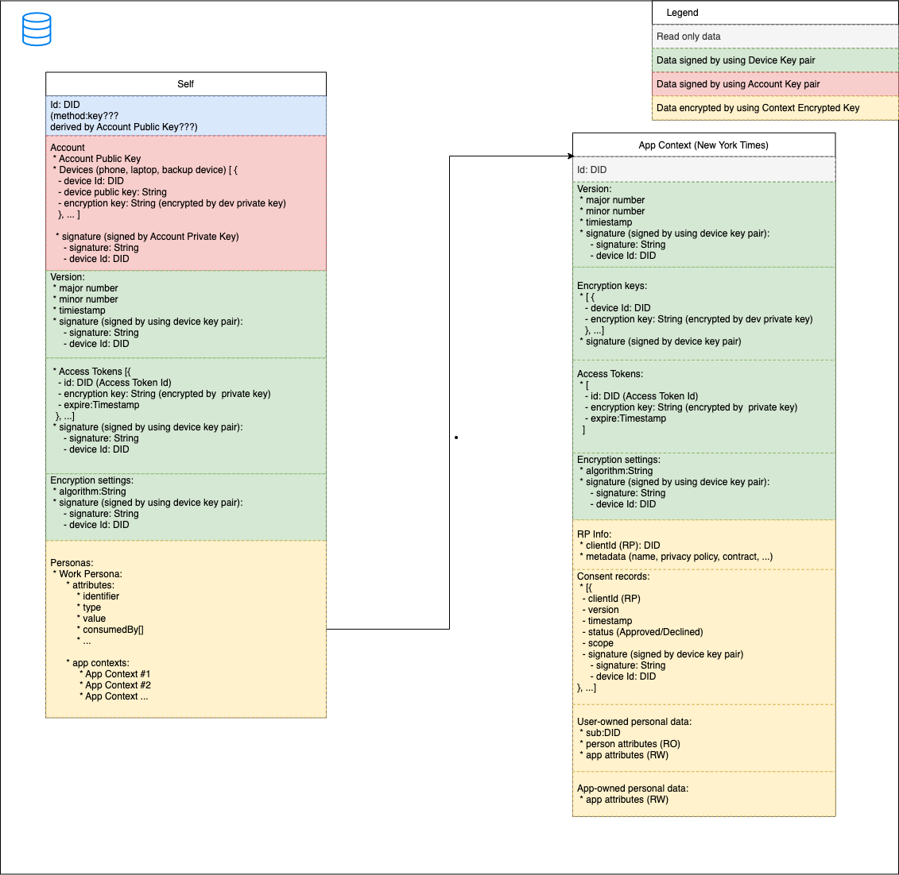

# Mee Contexts  

 

### Use cases: 

#### Install Mee app on the 1st device
1. Generate Account key pair [kyber-512](https://pq-crystals.org/kyber/index.shtml)
1. Generate Account [DID](https://www.w3.org/TR/did-core/)
1. Save Account Private key in the OS secure storage (iOS Keychain)  
1. Generate Device key pair [kyber-512](https://pq-crystals.org/kyber/index.shtml)
1. Generate Device [DID](https://www.w3.org/TR/did-core/)
1. Save Device Private key in the OS secure storage (iOS Keychain)  
1. Generate Self (root) context encryptio key
1. Encrypt Self context encryption key with Device key pair
1. Build/write Self context  

#### Sign in (SIOP)
1. Invocation step (see [Self-Issued OpenID Provider v2](https://openid.net/specs/openid-connect-self-issued-v2-1_0.html))  
1. Discovery RP information 
1. Generate RP context encryptio key
1. Encrypt RP context encryption key with Device key pair
1. Generate user identifier for RP (sub)
1. Build/write RP context  
1. Start Consent flow
1. Save Consent record
1. Show shared attribute
1. Collect missing attribute
1. Save provide data in the RP context
1. Update reference and attribute data in the Self context
1. Build IDToken

#### Import Google/Facebook/Twitter profile via OAuth flow
TBD

#### Add new personal device 
TBD

#### Add new cloud instance 
TBD

#### Backup data to file 
TBD

#### Recovery data from backup
TBD

#### Remove device (erase data on stolen device) 
TBD