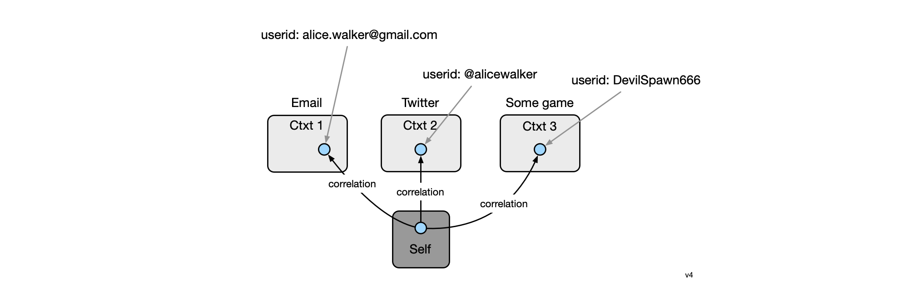
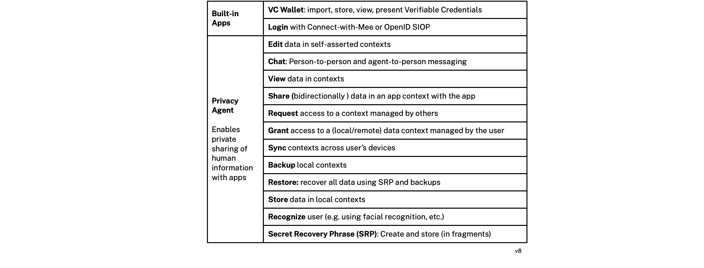

### End-user perspective

A privacy agent is a minimalist, occasional use app that acts as the user's personal digital twin. It manages their digital self and its expression in different contexts. It preserves the user's privacy when they are interacting with Mee-compatible apps and websites that have licensed the user's data according to the terms of the Mee Human Information License. 

Although a privacy agent is an interactive application, it operates mostly in the background, sharing and managing human information about the user with Mee-compatible apps according to the user's information sharing preferences and under the terms of the Human Information License. This shared information can be used for many purposes. These include: simplifying sign-in/sign-up, to providing contact information, payment methods, as well as sharing preferences, interests, etc. that apps can use to provide personalization, recommendations, and tailored offers. 

### Self and contexts

The agent represents both the user's *selfness* and *whonesses* (see [Concepts](Concepts.md) for more about these concepts)

The selfness of the user is held in a data container called the *Self*. The contents of the Self are holistic and therefore quite sensitive. For this reason they would normally not be shared in a direct or comprehensive form with others. This self abstraction is at the heart of what enables the Mee architecture to be a ""*meta*-identity system," as opposed to an identity system. The user's self is the point of integration across contexts each of which may be from differing identity systems. 

Each context is represented by a *context* data container. A directed *correlation* link points from an entity in the self to the entities representing the user in each context. For privacy reasons only the user should know that each of these separate contexts contain representations of the same individual. Each context may define its own identifier namespace, schemas, state management, communications protocols, UI, UX, etc. 

We can illustrate all of these concepts with a simple example. A user might have a gmail address, a Twitter handle, and in a game they play have the handle DevilSpawn666. Here's a simplified view of how this is represented:

### Functionality

The following table provides an overview of the functionality of an agent:

**End-user functionality provided by built-in apps:**

- **VC Wallet:** import, store, view, and present Verifiable Credentials (VCs)
- **Login**: login with Connect-with-Mee or OpenID SIOP

**End-user functionality:**

- **Edit** data in self-asserted contexts
- **Chat**: Person-to-person and agent-to-person messaging

- **View** data in contexts
- **Share** (bi-directionally) data in an app contxt with the app
- **Request** access to a context managed by others

- **Grant** access to a (local or remote) data context managed by the user
- **Sync** contexts across user's devices
- **Backup** local contexts

- **Restore**: recover all data using SRP and backups

- **Store** data in local contexts
  - Data is stored according to shared or app-specific schema. In some contexts this local data is authoritative whereas in other cases it is a copy of externally managed context data.

- **Recognize** user (e.g. using facial recognition, etc.)

- **Secret Recovery Phrase**: Create and store (in fragments)
  - During installation the user is asked create a **Secret Recovery Phrase (SRP)** that is never shared. This SRP is used as a source of entropy for the generation of cryptographic keys and thus acts as a root for a person's identity. Their data is encrypted using keys generated from the SRP. For disaster recovery purposes the user is encouraged to divide the SRP into encrypted fragments according to Shamir's [How to share a secret](https://dl.acm.org/doi/10.1145/359168.359176). The agent presents the user with a choice of options for where to store these fragments including with friends (for "social recovery"), in files and optionally in a Shared Secret Service hosted by a service provider the user trusts.