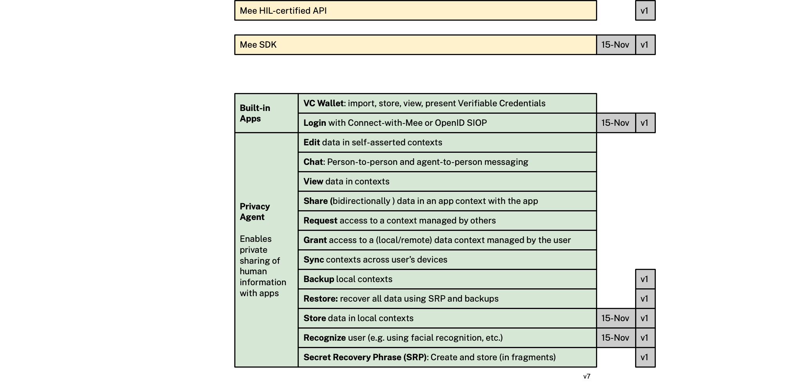

### Roadmap

Nov-15 (iOS only)

- Mee SDK
- Login with Connect-with-Mee (mobile app/browser only)
- Store very simple context data (userid only!) in a context
- Recognize the user using faceID

v1 - TBD, 2022

- Login with Connect-with-Mee (mobile app/browser or desktop browser)
- Backup local contexts
- Restore
- SRP

v2 - TBD, 2022:

- iOS and Android support

v3 - Feb, 2023

- Support social/other SRP sharding and recovery

v4 - April 2023

- Verifiable Credential wallet 
- Integrated P2P text messaging
- Replicate user's data across the their devices
- Review some kinds of context data
- Request access to another person's data
- Authorize access to your data by another
- Manage backup/restore of user's data

v5 - October 2023

- MacOS and Windows support
- Integrated & standalone password manager